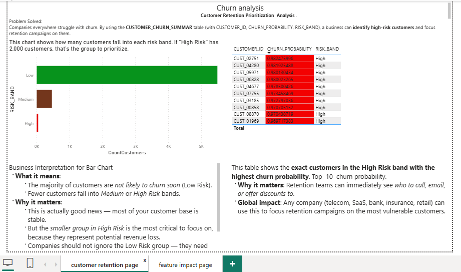
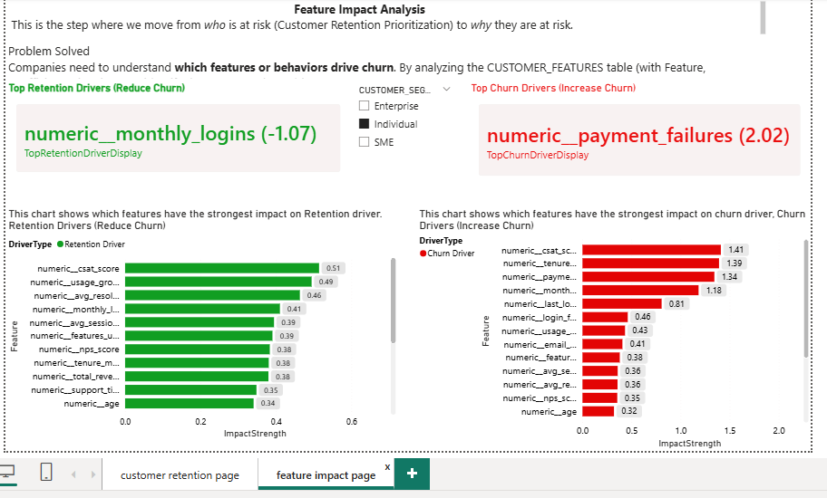
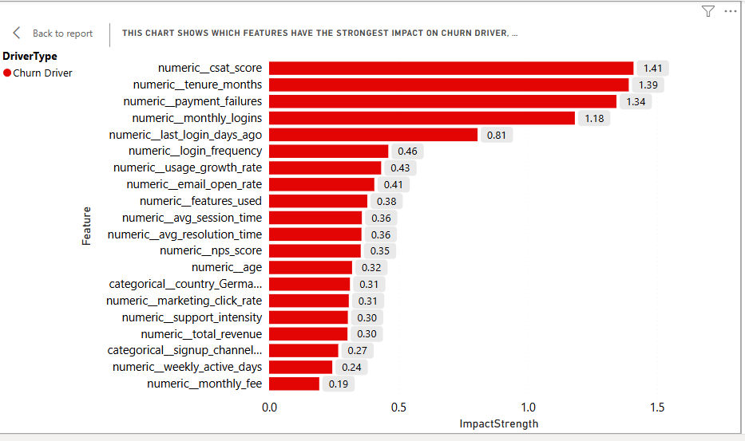
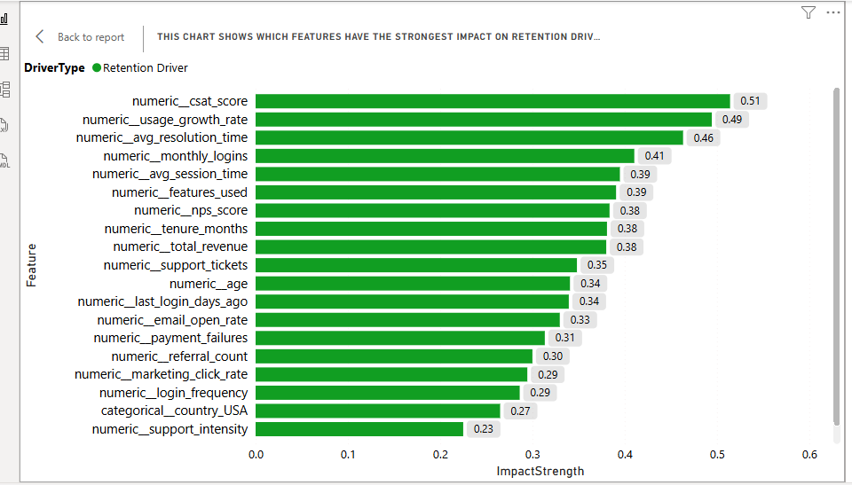

# Customer Churn Analysis 

---
##  Project Overview
This project analyzes customer churn using machine learning and visualizes results in Power BI.  
It combines exploratory analysis, automated scoring, and interactive dashboards.

---

##   Folder Structure
- `notebooks/` → Jupyter notebooks for exploration and feature engineering
- `automation/` → Python scripts for automated scoring and Snowflake integration
- `models/` → Saved ML pipeline (`churn_pipeline.pkl`)
- `powerbi/` → Power BI dashboard (`churn_dashboard.pbix`)
- `docs/images/` → Screenshots and diagrams
- `README.md` → Project documentation

--- 

##  Workflow
1. Train pipeline in Jupyter (`churn_analysis.ipynb`)
2. Save trained model to `models/churn_pipeline.pkl`
3. Run automation script (`retention_pipeline.py`) to score new data and load results into Snowflake
4. Visualize churn risk in Power BI (`churn_dashboard.pbix`)

---

##  Requirements
- Python 3.9+
- Libraries: pandas, scikit-learn, xgboost, joblib, snowflake-connector
- Power BI Desktop
- Snowflake account

---

##  Usage
- Run notebook to retrain model
- Execute automation script to score data
- Open Power BI dashboard for visualization

---

##  Results
- Achieved **~85% accuracy** in predicting customer churn  
- Improved recall for high‑risk customers, enabling proactive retention strategies  
- Automated scoring pipeline reduces manual effort and integrates directly with Snowflake  

---
##  Business Impact
- Helps companies identify at‑risk customers early  
- Supports data‑driven retention campaigns  
- Provides executives with interactive dashboards for decision‑making  

---
## Tech Stack
- **Languages**: Python  
- **Libraries**: pandas, scikit‑learn, XGBoost, joblib  
- **Data Warehouse**: Snowflake  
- **Visualization**: Power BI  

---
##  Dashboard Preview
### Customer Retention Dashboard

### Feature Impact Dashboard

### Churn Drivers

### Retention Drivers

---  

##  Future Work
- Integrate real‑time scoring API  
- Expand to multi‑channel customer data (CRM, support logs, etc.)  
- Deploy dashboards to Power BI Service for enterprise sharing  

---

##  Author
**Chikaodili Eze (GOSPEL92)**  
Data Analyst | Machine Learning Enthusiast | Business Intelligence Developer
